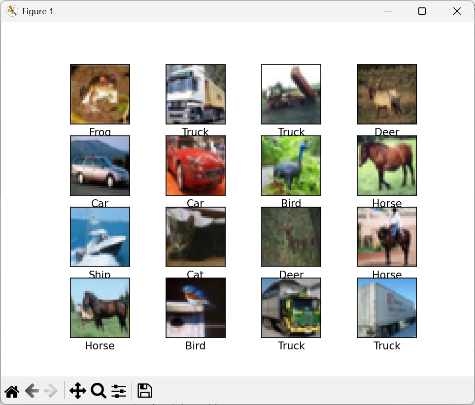
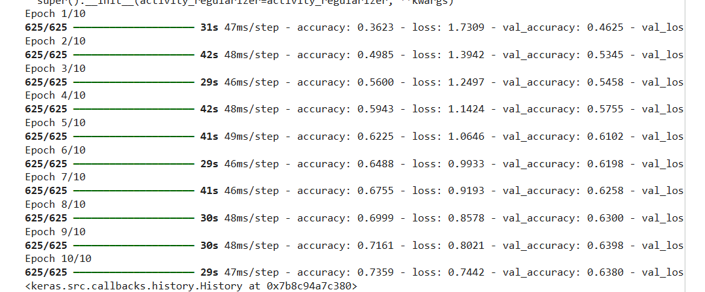
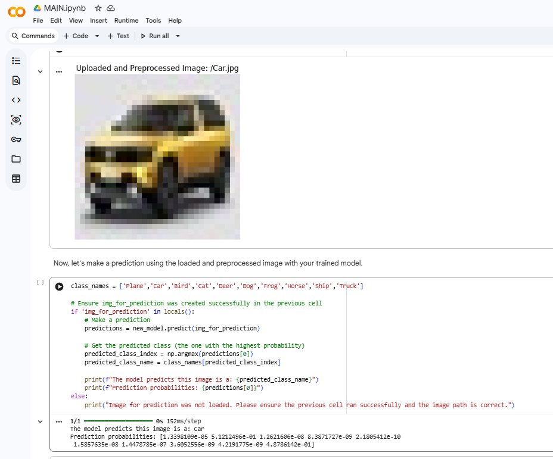
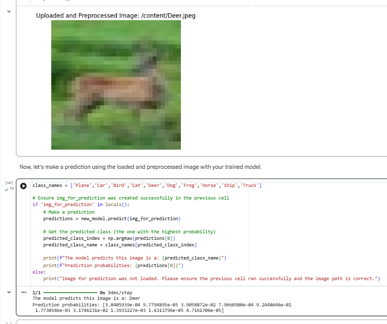
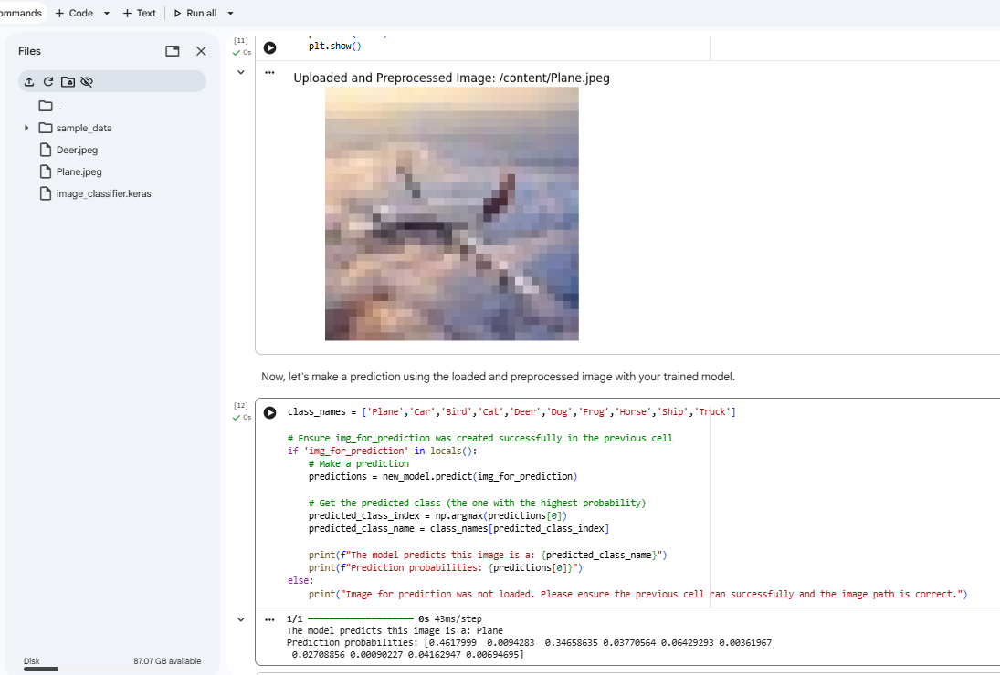
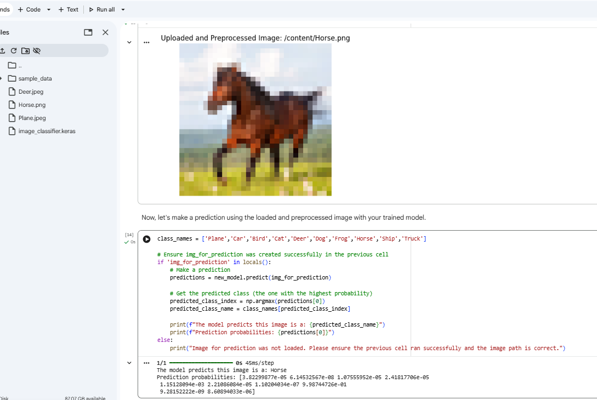

# Image Classifier using CNN (CIFAR-10)

## Project Overview

This project implements a Convolutional Neural Network (CNN) using TensorFlow and Keras to classify images from the CIFAR-10 dataset. The model is trained on thousands of labeled images and can predict objects belonging to one of ten categories.

The project demonstrates the complete deep learning workflow, including data preprocessing, model building, training, evaluation, and prediction on custom images.

---

## Dataset

The model uses the CIFAR-10 dataset, which contains 60,000 color images of size 32×32 distributed across 10 classes:

- Airplane
- Automobile
- Bird
- Cat
- Deer
- Dog
- Frog
- Horse
- Ship
- Truck

---

## Technologies Used

- Python
- TensorFlow
- Keras
- NumPy
- Matplotlib
- OpenCV
- Jupyter Notebook

---

## Model Architecture

The CNN architecture consists of:

- Conv2D (32 Filters, ReLU)
- MaxPooling2D
- Conv2D (64 Filters, ReLU)
- MaxPooling2D
- Conv2D (64 Filters, ReLU)
- Flatten Layer
- Dense Layer (64 Neurons)
- Softmax Output Layer (10 Classes)

---

## Project Structure

```text
Image Classifier
│
├── images
│   ├── dataset_samples.png
│   ├── Result1.png
│   ├── Result2.png
│   ├── Result3.png
│   ├── Result4.png
│   ├── training_epochs.png
│   │
│   └── test_cases
│       ├── Car.jpg
│       ├── Deer.jpeg
│       ├── Horse.png
│       └── Plane.jpeg
│
├── models
│   └── model_layers.ipynb
│
├── notebooks
│   └── cifar10_image_classifier.ipynb
│
├── README.md
├── requirements.txt
└── .gitignore
```

---

## Dataset Samples

The following image shows sample images from the CIFAR-10 dataset used for training the CNN model.



---

## Training Performance

The graph below illustrates the model's training and validation performance across multiple epochs.



---

## Prediction Results

The trained model was tested on multiple custom images to evaluate its classification capability.

### Prediction Result 1



### Prediction Result 2



### Prediction Result 3



### Prediction Result 4



---

## Features

- Image Classification using Convolutional Neural Networks (CNN)
- CIFAR-10 Dataset Implementation
- Custom Image Prediction Support
- Data Visualization and Analysis
- Model Evaluation and Performance Monitoring
- Jupyter Notebook Based Workflow

---

## How to Run

### Clone the Repository

```bash
git clone https://github.com/mohammedifteqhar/Image-classifier.git
```

### Navigate to the Project Directory

```bash
cd Image-classifier
```

### Install Dependencies

```bash
pip install -r requirements.txt
```

### Run the Notebook

Open the following notebook using Jupyter Notebook, JupyterLab, or VS Code:

```text
notebooks/cifar10_image_classifier.ipynb
```

---

## Future Improvements

- Data Augmentation
- Transfer Learning using ResNet or VGG16
- Hyperparameter Tuning
- Larger Training Dataset
- Web Application Deployment using Flask or Streamlit
- Real-Time Image Classification

---

## Author

**Mohammed Ifteqhar**

- GitHub: https://github.com/mohammedifteqhar
- LinkedIn: https://www.linkedin.com/in/md-ifteqhar-791227340

---

## License

This project is intended for educational, learning, and portfolio purposes.
